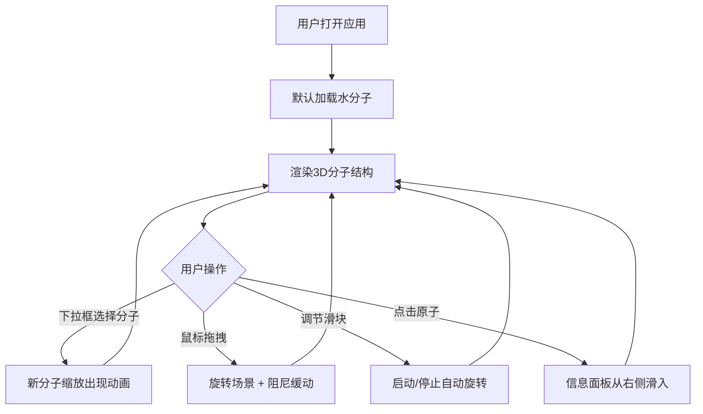

## 1. 产品概述

交互式3D分子结构查看与旋转操作应用，让用户在浏览器中加载、查看和操作常见分子结构模型（水、甲烷、葡萄糖）。

- 主要用途：化学教育、科学可视化、分子结构演示
- 目标用户：学生、教师、科研人员、化学爱好者
- 产品价值：提供直观、可交互的3D分子可视化体验，帮助理解分子空间结构

## 2. 核心功能

### 2.1 功能模块

1. **3D分子渲染模块**：基于Three.js渲染原子球体和化学键圆柱体
2. **分子切换模块**：下拉框选择分子类型，带动画过渡效果
3. **交互控制模块**：鼠标拖拽旋转、轨道控制器、自动旋转
4. **原子信息展示模块**：点击原子显示详细信息面板

### 2.2 页面详情

| 页面名称 | 模块名称 | 功能描述 |
|-----------|-------------|---------------------|
| 主页面 | 3D场景 | 全屏渲染分子3D结构，支持拖拽旋转、缩放 |
| 主页面 | 顶部控制面板 | 分子选择下拉框、旋转速度滑块、重置按钮 |
| 主页面 | 原子信息面板 | 右上角显示被点击原子的名称、颜色、半径 |

## 3. 核心流程

用户打开应用 → 默认显示水分子 → 通过下拉框切换分子（缩放动画）→ 鼠标拖拽旋转分子 → 调节旋转速度滑块实现自动旋转 → 点击原子查看详细信息

## 4. 用户界面设计

### 4.1 设计风格

-