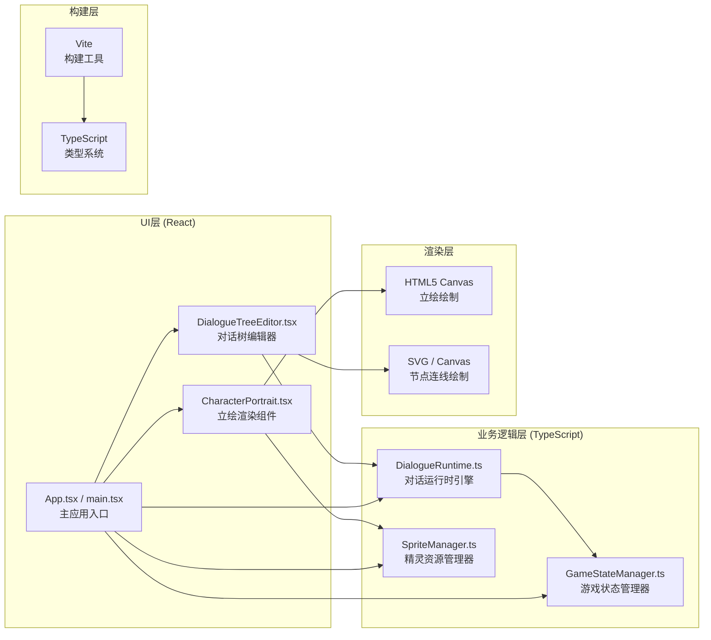
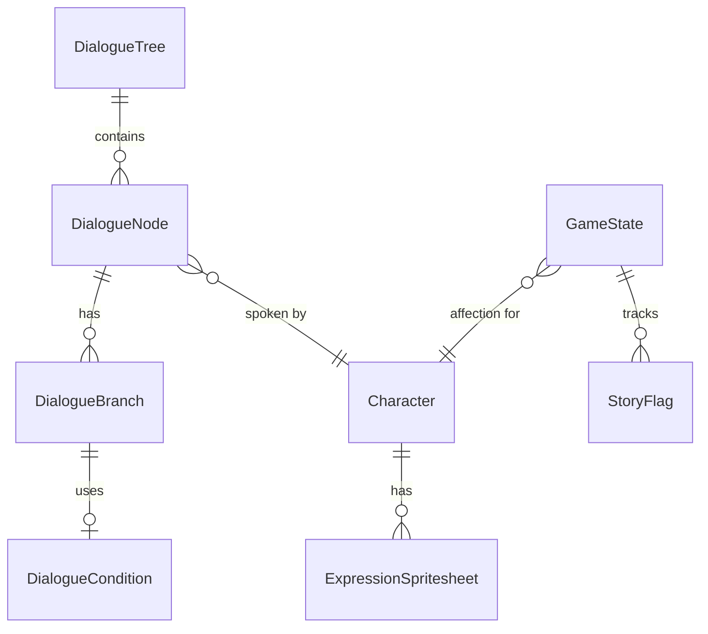

## 1. 架构设计



## 2. 技术描述

- **前端框架**：React 18 + TypeScript（严格模式）
- **构建工具**：Vite 5 + @vitejs/plugin-react
- **UI渲染**：
  - 对话节点：React DOM组件 + 绝对定位
  - 分支连线：SVG贝塞尔曲线
  - 角色立绘：HTML5 Canvas API
  - 动画效果：CSS transitions/animations + requestAnimationFrame
- **状态管理**：
  - 游戏状态：GameStateManager单例模式
  - UI状态：React useState/useReducer
- **模块间通信**：直接函数调用 + 观察者模式回调
- **无后端**：纯前端应用，所有数据存储于内存中，支持LocalStorage持久化（可选）

## 3. 路由定义

| 路由 | 用途 |
|------|------|
| / | 主应用界面（对话编辑器 + 立绘预览） |

*单页面应用，无需多路由*

## 4. 核心类型定义

```typescript
// 对话节点类型
type SpeakerType = 'player' | 'npc';

type ConditionType = 'affection_gt' | 'affection_lt' | 'affection_eq' 
    | 'time_range' | 'story_triggered';

interface DialogueCondition {
    type: ConditionType;
    value: number | string;
    value2?: number; // 用于time_range的结束值
    priority: number; // 条件严格程度优先级
}

interface DialogueBranch {
    targetNodeId: string;
    condition?: DialogueCondition;
    optionText: string;
}

interface DialogueNode {
    id: string;
    speaker: SpeakerType;
    characterId?: string; // NPC角色ID
    expressionId?: ExpressionType; // 表情ID
    text: string;
    branches: DialogueBranch[];
    position: { x: number; y: number }; // 编辑器位置
}

interface DialogueTree {
    id: string;
    rootNodeId: string;
    nodes: Record<string, DialogueNode>;
}

// 表情类型
type ExpressionType = 'default' | 'happy' | 'sad' | 'angry' | 'surprised';

// 立绘精灵数据
interface SpriteFrameData {
    x: number;
    y: number;
    width: number;
    height: number;
}

interface CharacterSpritesheet {
    characterId: string;
    image: HTMLImageElement;
    expressions: Record<ExpressionType, SpriteFrameData[]>;
    frameCount: number;
}

// 游戏状态
interface GameState {
    affection: Record<string, number>; // 各角色好感度
    currentTime: number; // 游戏内时间 0-24
    storyFlags: Record<string, boolean>; // 剧情触发标记
}

// 对话运行时输出
interface RuntimeOutput {
    currentNode: DialogueNode;
    speaker: SpeakerType;
    displayText: string;
    availableBranches: DialogueBranch[];
}
```

## 5. 文件结构与调用关系

```
src/
├── main.tsx                     [入口] 初始化SpriteManager → 挂载App
├── App.tsx                      [容器] 组装所有子模块，协调数据流
│
├── dialogue/
│   ├── DialogueTreeEditor.tsx   [编辑器UI]
│   │   数据流：用户拖拽/点击 → React State更新 → 绘制节点与连线
│   │   调用：onUpdateTree回调 → App → 传给DialogueRuntime
│   │
│   └── DialogueRuntime.ts       [运行时引擎]
│       输入：DialogueTree + GameState
│       调用：GameStateManager.getState() → 条件判断 → 输出对话片段
│
├── character/
│   ├── CharacterPortrait.tsx    [立绘Canvas组件]
│   │   输入：characterId + expressionId
│   │   调用：SpriteManager.getFrames() → Canvas渲染 + 动画
│   │
│   └── SpriteManager.ts         [资源管理]
│       初始化：main.tsx调用preloadAll()
│       输出：getFrames(characterId, expressionId) → 帧数据
│
└── game/
    └── GameStateManager.ts      [状态管理，单例]
        输入：App/UI调用setState()
        输出：DialogueRuntime调用getState()
```

## 6. 数据模型

### 6.1 实体关系图



### 6.2 核心模块设计

**GameStateManager（单例模式）**
- 方法：`getInstance()`, `getState()`, `setAffection(characterId, value)`, 
  `setTime(hour)`, `triggerStory(flagId)`, `checkCondition(condition)`
- 内部存储：private state对象，无外部直接修改

**DialogueRuntime**
- 方法：`setTree(tree)`, `startFrom(nodeId)`, `next(branchIndex?)`, 
  `getCurrentOutput()`, `evaluateBranch(branch)`
- 核心算法：分支优先级排序（条件严格程度降序）→ 依次checkCondition → 返回首个匹配

**SpriteManager**
- 方法：`preloadAll(onProgress)`, `getFrames(characterId, expressionId)`,
  `isLoaded()`, `retryLoad()`
- 缓存：Map<characterId, CharacterSpritesheet>
- Spritesheet规范：PNG格式，1:1帧，帧间距2px，每角色10帧，每行5帧共2行

**CharacterPortrait（Canvas渲染）**
- 使用双Canvas或双图层实现交叉淡入淡出：
  - 底层：当前表情帧（透明度从1→0）
  - 顶层：新表情帧（透明度从0