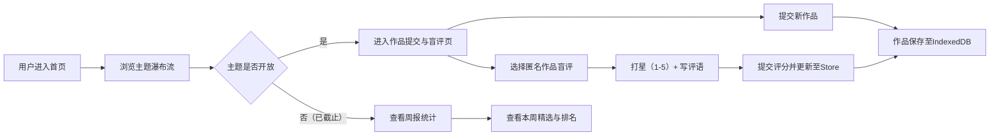

## 1. 产品概述

CritiqueCircle 是一个面向大学文学社的匿名作品互评与评选平台，社员可围绕每周主题提交原创短篇作品，进行匿名盲评打分，并自动评选每周最佳。

- **核心价值**：营造公平、温暖的文学创作与交流氛围，通过匿名机制保护创作热情，以每周评选激励持续创作。
- **目标用户**：大学文学社社员及文学爱好者。

## 2. 核心功能

### 2.1 用户角色

本应用无严格角色区分，所有用户均可提交作品与参与评分，但在数据层面支持管理员创建主题。

| 角色 | 注册方式 | 核心权限 |
|------|----------|----------|
| 普通用户 | 本地匿名用户 | 浏览主题、提交作品、参与盲评、查看周报 |
| 管理员 | 本地标记 | 创建新主题、管理主题生命周期 |

### 2.2 功能模块

1. **主题列表页（首页）**：展示历史主题瀑布流卡片，支持创建新主题。
2. **作品提交与盲评页**：左栏匿名作品列表与盲评模式，右栏新作品提交表单。
3. **周报统计页**：展示本周精选、作品评分排名、获奖评语。

### 2.3 页面详情

| 页面名称 | 模块名称 | 功能描述 |
|----------|----------|----------|
| 主题列表页 | 主题卡片瀑布流 | 显示主题标题、起止日期、作品数，悬停上浮动画，点击进入详情 |
| 主题列表页 | 新建主题表单 | 管理员可创建主题（标题、描述、起止日期） |
| 作品提交与盲评页 | 作品列表（左栏） | 匿名编号作品摘要列表，点击进入盲评模式 |
| 作品提交与盲评页 | 盲评模式 | 居中展示作品正文，1-5星评分组件，200字评语输入，每人每作品仅评一次 |
| 作品提交与盲评页 | 作品提交（右栏） | 输入标题与正文（限2000字），提交后生成匿名编号 |
| 周报统计页 | 本周精选 | 金色奖杯动画，获奖作品卡片（渐变边框），显示平均分与评语精选 |
| 周报统计页 | 评分排名 | 所有作品按均分降序排列，显示作品编号、均分、评语条数 |

## 3. 核心流程

用户核心操作流程：浏览主题 → 选择当前开放主题 → 提交作品/参与盲评 → 主题截止后查看周报。

## 4. 用户界面设计

### 4.1 设计风格

- **主色调**：羊皮纸色背景 `#F5E6C8`，深褐文字 `#4A3B32`，墨绿强调 `#3A6B47`，金色点缀 `#C9A227`
- **按钮风格**：半透明圆角按钮，悬停时背景加深，点击星星产生旋转填充动画（0.2s ease）
- **字体**：正文使用衬线字体 Georgia，行高 1.8，首行缩进 2 字符
- **布局风格**：瀑布流卡片布局、极简主义排版、卡片阴影与悬停上浮
- **动画元素**：奖杯左右摇摆（CSS keyframes）、星级旋转填充、卡片 translateY -2px + 阴影加深

### 4.2 页面设计概述

| 页面名称 | 模块名称 | UI 元素 |
|----------|----------|---------|
| 主题列表页 | 主题卡片 | 羊皮纸背景卡、深褐标题、墨绿日期标签、阴影、悬停上浮动画 |
| 作品提交与盲评页 | 作品列表 | 匿名编号标签、摘要截断、点击高亮、Georgia 衬线字体 |
| 作品提交与盲评页 | 盲评模态 | 居中卡片、星级按钮、评语输入框、墨绿提交按钮 |
| 作品提交与盲评页 | 提交表单 | 标题输入框、正文 textarea（2000字限制）、字数统计 |
| 周报统计页 | 本周精选 | 金色摇摆奖杯、渐变边框卡片、获奖评语精选 |
| 周报统计页 | 排名列表 | 排名序号、均分、评语条数、墨绿分割线 |

### 4.3 响应式设计

- 桌面端优先（Desktop-first）
- 断点：768px
- 适配规则：卡片列数由 4 列变 1 列，左右两栏布局改为上下堆叠，按钮尺寸适配触摸

