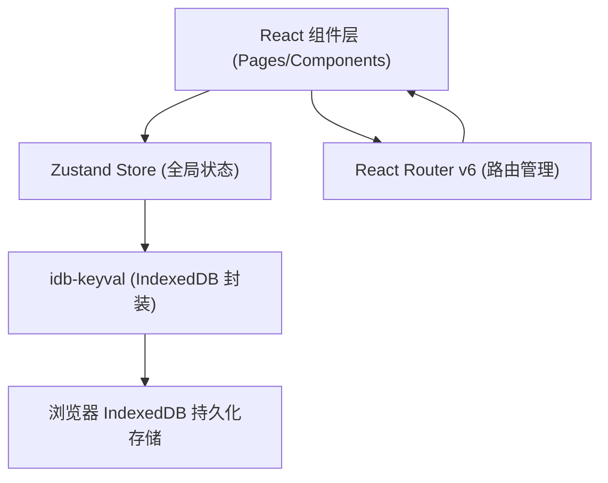
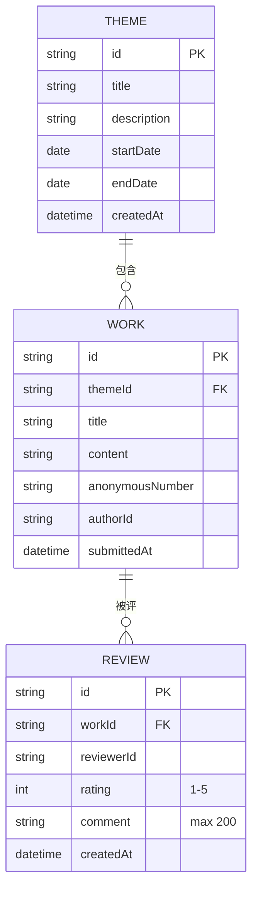

## 1. 架构设计

纯前端单页应用（SPA），无后端依赖，数据通过 IndexedDB 在浏览器本地持久化。



**调用关系与数据流向**：
- `types.ts` → 定义所有类型接口，被各模块导入使用
- `store.ts` → 管理 themes / works / reviews 状态，提供 CRUD actions，被 App 与各 Page 直接调用
- `App.tsx` → 从 store 读取当前主题，根据路由渲染对应 Page 组件
- `pages/*` → 从 store 读取数据并 dispatch actions

## 2. 技术栈描述

- **前端框架**：React 18 + TypeScript
- **构建工具**：Vite
- **路由**：react-router-dom v6
- **状态管理**：Zustand
- **本地持久化**：IndexedDB（通过 idb-keyval 封装）
- **工具库**：uuid（生成唯一ID）
- **样式方案**：原生 CSS（CSS Variables 主题系统）+ 模块化 CSS

## 3. 路由定义

| 路由 | 页面组件 | 用途 |
|------|----------|------|
| `/` | ThemeList | 主题列表页（首页），瀑布流展示所有历史主题 |
| `/theme/:id` | WorkSubmitReview | 作品提交与盲评页，核心功能页面 |
| `/report` | WeeklyReport | 周报统计页，展示本周精选与排名 |

## 4. 数据模型

### 4.1 实体关系



### 4.2 TypeScript 类型定义

```typescript
// Theme - 每周主题
interface Theme {
  id: string;
  title: string;
  description: string;
  startDate: string; // ISO date string
  endDate: string;   // ISO date string
  createdAt: string;
}

// Work - 匿名作品
interface Work {
  id: string;
  themeId: string;
  title: string;
  content: string;
  anonymousNumber: number; // 作品编号，如 7 -> "作品#7"
  authorId: string;        // 本地用户ID（匿名标识）
  submittedAt: string;
}

// Review - 评分与评语
interface Review {
  id: string;
  workId: string;
  reviewerId: string;
  rating: number; // 1-5 整数
  comment: string; // max 200 chars
  createdAt: string;
}

// WeeklyReport - 周报统计（计算生成）
interface WeeklyReport {
  themeId: string;
  winnerWorkId: string;
  winnerAverage: number;
  rankings: Array<{
    workId: string;
    anonymousNumber